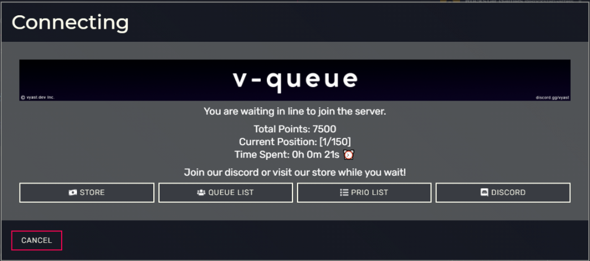
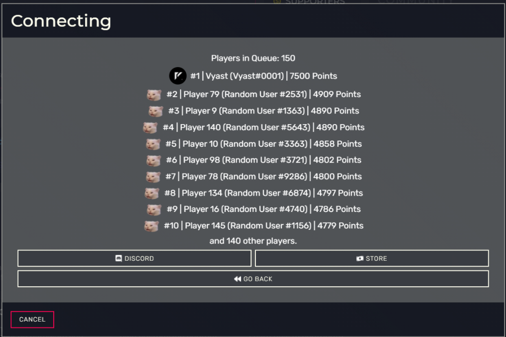
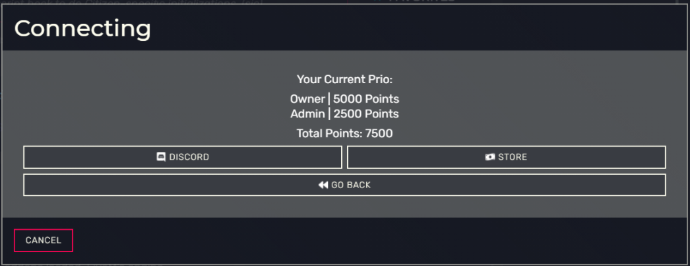

# Info

v-queue is a modern FiveM queue system. If you are not familiar with a queue, it is used as a waiting list/line for players when your server reaches its maximum player capacity.

**NOTE:** This resource is protected & encrypted through the Asset Escrow system, meaning the core files are encrypted, but the resource is still highly configurable.

**Price:** $39.99 (One-time Purchase)

Ready to Purchase? **[Click Here](https://store.vyast.dev/package/4957183)**

